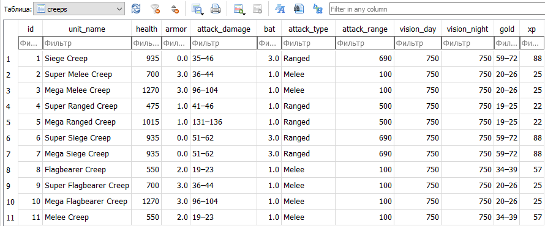
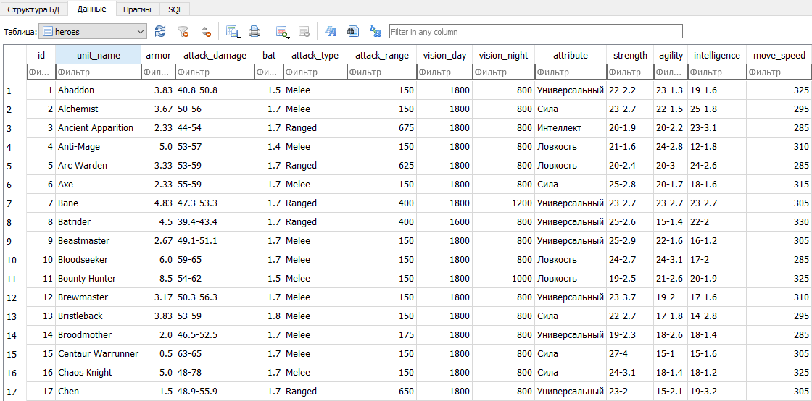
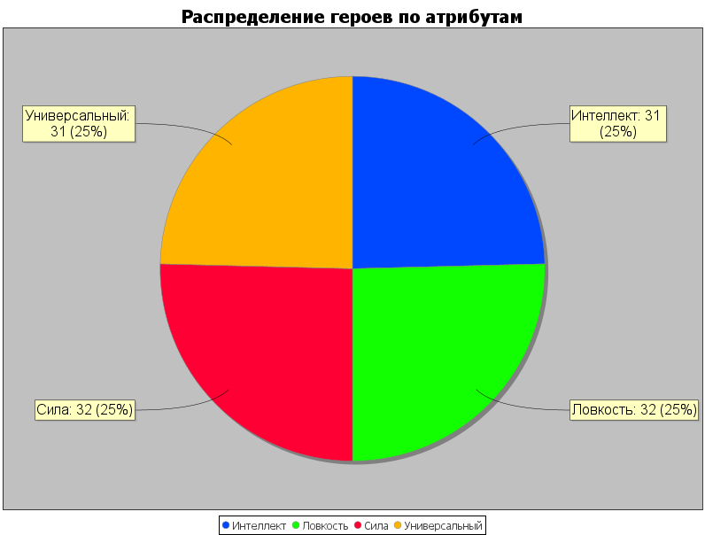

# JavaProject
Проект о Юнитах из игры DOTA2
## Классы 
Класс Unit имеет поля Названия, Брони, Урона, Здоровья, Скорости атаки и Дальности обзора

Класс Creep наследуется от Unit и имеет поля XP и Gold

Класс Hero наследуется от Unit и имеет поля Атрибута, Силы, Ловкости, Интеллекта и Скорости передвижения

____

## Данные и Визуализация
Данные были взяты из сайтов dota.wiki, классы CreepParse и HeroParse парсят страницы и получают данные для БД.

***Таблица Крипов***

***Таблица Героев***

***Визуализация героев по атрибутам***

____

